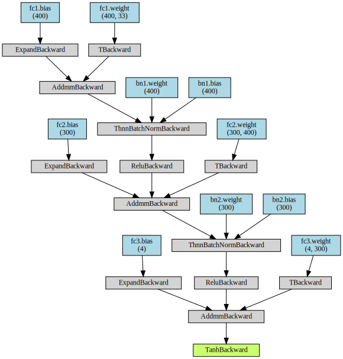
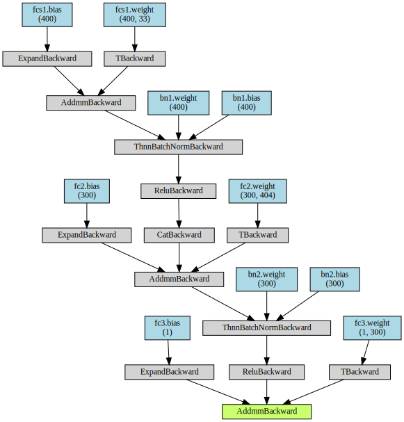
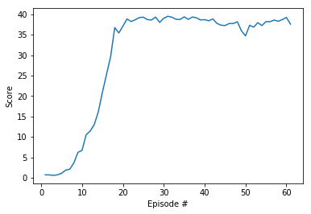

# Learning Algorithm

DDPG: Deep Deterministic Policy Gradient, Soft Updates

The following alghoritm was used as starting point
https://github.com/udacity/deep-reinforcement-learning/tree/master/ddpg-pendulum
The algorithm was used to solve multi agent environment. 
```
- learning reate for actor was changed to 1e-3
- agent and model networks were extended with batch normalizations 
- agent was extended to support multiple agents
- noise class was modified to support multiple agents
- noise reset has been added after soft_updates - that helps with final overfitting problem
Different strategies were tested as well, but without significat benefit
e.g. 
- weight_decay was causing disapearing of the gradients too fast, possible benefit if choosen properly
- learning rates for both were modifided a couple of times but eventually 1e-3 for both appeared to fit best
- gradient clipping for training the critic network was used but didn't get expected results
- couple of different strategies to update actor and critic networks were used but results were not good enough
- dropout was used in both critic and actor networks but it didn't bring expected benefits
```

## Hyperparameters
```
BUFFER_SIZE = int(1e6)  # replay buffer size
BATCH_SIZE = 128        # minibatch size
GAMMA = 0.99            # discount factor
TAU = 1e-3              # for soft update of target parameters
LR_ACTOR = 1e-3         # learning rate of the actor 
LR_CRITIC = 1e-3        # learning rate of the critic
WEIGHT_DECAY = 0.0     # L2 weight decay
```
## Actor architectures

## Critic architectures

# Plot of Rewards


```
Episode 61	Score: 37.58	Average Score: 30.01
Environment solved in -39 episodes!	Average Score: 30.01
```
# Ideas for Future Work
Verify how far we can get with the following alghoritms:
- PPO: https://arxiv.org/pdf/1707.06347.pdf
- A3C: https://arxiv.org/pdf/1602.01783.pdf
- D4PG: https://openreview.net/pdf?id=SyZipzbCb
